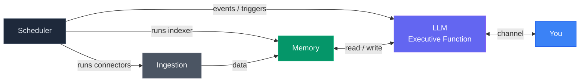

# Edwin

**Personal AI Chief of Staff -- built on cognitive architecture principles.**

Edwin is an AI assistant that runs your life. Not a chatbot. Not a framework. A persistent, memory-rich system designed around how your brain actually works -- with working memory, episodic memory, semantic memory, and prospective memory. It ingests your digital life, learns what matters to you, and handles the cognitive overhead that buries busy professionals.

Built on [Claude Code](https://claude.ai/claude-code) by Anthropic. Runs locally on your Mac. Your data stays on your machine.

## Why Edwin is different

Most AI agent frameworks are built by engineers thinking about tool orchestration. Edwin was built by a CTO thinking about cognitive architecture.

- **Memory modeled on human cognition.** Working memory (active context), episodic memory (what happened), semantic memory (what you know), prospective memory (what you need to do). Four systems, same as your brain.
- **The Briefing Book.** Your personal intelligence file, organized by cognitive domain -- briefs, calendar, actions, drafts, research, projects, people. Information goes where your brain expects to find it.
- **15 data connectors.** Email, calendar, iMessage, meeting transcripts, browser history, notes, photos, and more. Edwin sees what you see.
- **Autonomous skills.** Morning briefs, overnight research, weekly summaries. Set them once, they run like habits.
- **Semantic search across your entire life.** Qdrant vector store with contextual retrieval. Ask Edwin anything and it finds the answer across all your data.

## Quickstart

```bash
git clone https://github.com/brandtwelker/Edwin.git
cd Edwin
./setup.sh
claude
```

That's it. `setup.sh` installs the infrastructure (Qdrant, Neo4j, Ollama). `claude` starts the onboarding wizard -- a guided conversation where Edwin learns who you are and configures itself for your life. Takes about 15 minutes.

### Requirements

- **macOS** (local connectors use macOS databases; API connectors work cross-platform)
- **Claude Code** with an active Anthropic subscription
- **Docker** (for Qdrant and Neo4j)
- **Ollama** (for local embeddings)
- **Python 3.10+**

## The Cognitive Model

Edwin's architecture maps directly to how human cognition works:

- **Ingestion = Sensory Input.** 15 ETL connectors perceive your digital world and translate raw data into a format the brain can process. Email, messages, meetings, browser history -- each connector is a sense tuned to a different source.
- **Memory = Memory & Cognition.** The data lake feeds five memory systems that store, index, associate, and recall. The LLM reads and writes to all of them.
- **LLM = Executive Function.** Perceive, decide, act, monitor, adjust. The prefrontal cortex. The main session talks to you and delegates all work to sub-agents.



## Design Principles

1. **No vendor lock-in.** The LLM is swappable. The data is portable. Skills are plain markdown. Nothing depends on any single AI provider except the LLM API itself.
2. **Atomic purposes.** Each component does one thing. Connectors extract. The indexer embeds. The PM tracks commitments. Nothing is overloaded.
3. **Local-first.** All data lives on disk, in open formats (Markdown, SQLite, standard APIs). Nothing is cloud-only.
4. **The LLM is the orchestrator.** The main session talks to you and makes decisions. All work is delegated to sub-agents. Edwin decides what work to do -- sub-agents do it.
5. **The SKILL.md standard.** Procedural memory is portable markdown. Any LLM that can read text can execute a skill. No proprietary format.
6. **Know what you have.** Every tool, every skill, every service is indexed and discoverable. Edwin never says "I can't do that" about something it can do.

## Architecture

```
Edwin/
├── CLAUDE.md              # Edwin's identity + operating instructions (generated by wizard)
├── connectors/            # 15 data connectors (email, calendar, iMessage, etc.)
├── tools/
│   ├── indexer/           # Embeds your data into Qdrant for semantic search
│   ├── plombery/          # Scheduler dashboard (APScheduler + web UI)
│   └── session-slicer/    # Claude Code session processing
├── skills/                # Autonomous recurring tasks (morning brief, overnight loop, etc.)
├── mcp-servers/           # Claude Code MCP integrations (Qdrant, Neo4j, PM)
├── briefing-book/         # Your personal intelligence file (auto-organized)
├── data/                  # Synced data from connectors (gitignored)
├── memory/                # Session summaries + memory index (gitignored)
├── setup.sh               # One-command installer
├── reset.sh               # Selective teardown for re-testing
└── docker-compose.yml     # Qdrant + Neo4j infrastructure
```

## How it works

1. **Connectors** pull your digital life into `data/` as structured Markdown
2. **Indexer** embeds that Markdown into Qdrant with semantic vectors
3. **MCP servers** give Claude Code access to search, query, and track commitments
4. **Skills** run on schedule via Plombery -- morning briefs, overnight work, weekly reviews
5. **CLAUDE.md** gives Edwin its identity, personality, and operating rules
6. **You talk to Edwin** in Claude Code. It remembers, anticipates, and handles the rest.

## Connectors

### macOS Native (local databases, no API keys)
| Connector | What it syncs |
|-----------|--------------|
| notes | Apple Notes |
| browser | Safari + Chrome history |
| imessage | iMessage conversations |
| photos | Apple Photos metadata |
| calls | Phone call logs |
| contacts | Apple Contacts |
| screentime | App usage data |
| documents | Desktop, Documents, iCloud files |
| sessions | Claude Code conversation logs |

### API-Based (cross-platform, requires credentials)
| Connector | What it syncs |
|-----------|--------------|
| o365 | Outlook email, calendar, Teams |
| google | Gmail, Google Calendar |
| fireflies | Meeting transcripts |
| limitless | Limitless pendant lifelogs |
| atlassian | Jira, Confluence, Bitbucket |
| plaud | Plaud recording transcripts |

## Memory Tiers

Five memory systems, modeled on human cognition:

| Type | Purpose | System | How it works |
|------|---------|--------|-------------|
| **Semantic** | What things mean | Qdrant vectors + Ollama embeddings | Dense (+ optional sparse) vector search across all your data |
| **Episodic** | What happened | Neo4j knowledge graph | Entity relationships, multi-hop reasoning, timeline queries |
| **Procedural** | How to do things | SKILL.md files | Portable markdown instructions any LLM can execute |
| **Prospective** | What needs to happen | PM server (SQLite) | Commitments, tasks, intentions with due dates and owners |
| **Working** | What matters right now | Context window + session state | Boot sequence, session summaries, conversation-state.md, morning brief |

Working memory is more than the LLM's context window. It's a full system: session state that survives crashes, session summaries for continuity across conversations, a boot sequence that reconstructs context on startup, and a morning brief that primes the most important information first.

## Embedding Options

Edwin supports three tiers of search quality, each opt-in:

| Tier | What | Cost | Requirement |
|------|------|------|-------------|
| Dense only | Ollama embeddings | Free | Ollama (included in setup) |
| Dense + Sparse | Adds BM42 hybrid search | Free | Python 3.12 + fastembed |
| Dense + Sparse + Context | Adds Haiku context prefixes | ~$10-20 per full index | Anthropic API key |

Default is dense-only. Upgrade anytime by asking Edwin.

## Platform

macOS-native connectors ship today. Windows/Linux equivalents welcome as PRs -- the connector interface is simple and documented. API-based connectors work on any platform.

## License

Apache 2.0 -- see [LICENSE](LICENSE).

## Origin

Edwin was built over six months by a CTO who needed a chief of staff and couldn't find one that worked. The name comes from Edwin Jarvis. The architecture comes from cognitive science. The code comes from using it every day to run a real life.

---

*Built with [Claude Code](https://claude.ai/claude-code) by Anthropic.*
