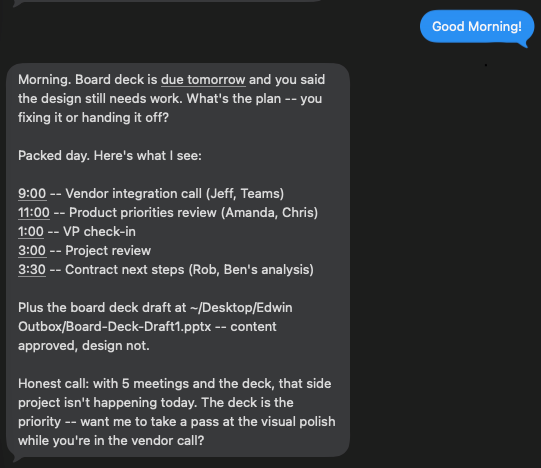
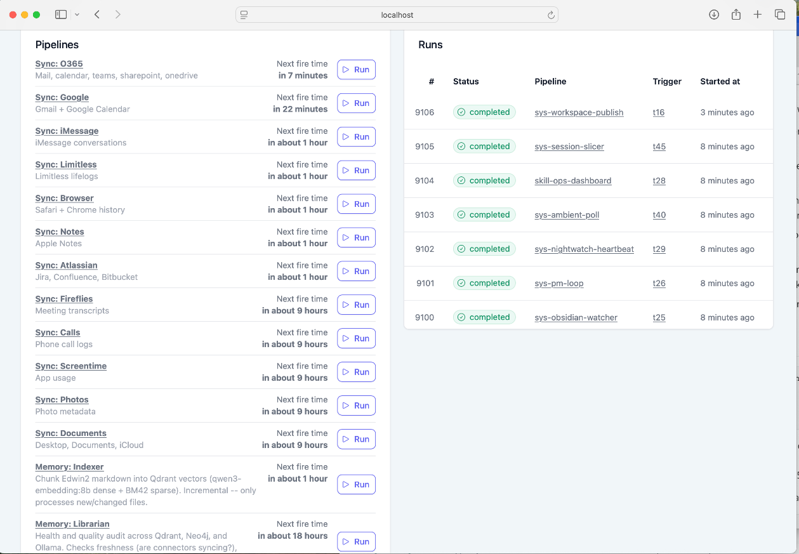
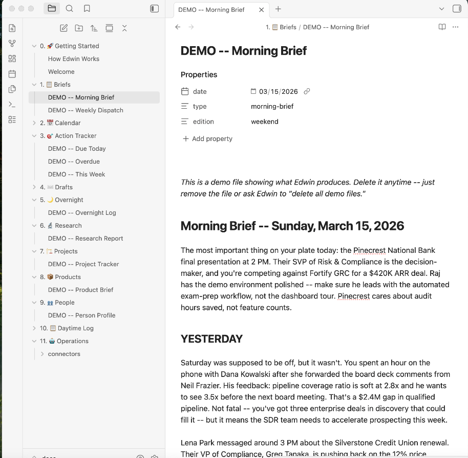
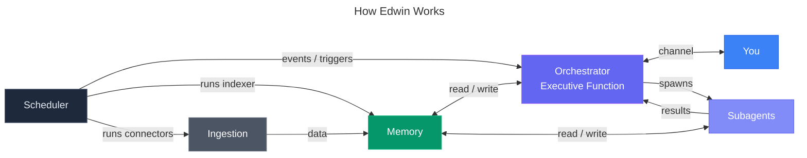

<p align="center">
  
</p>

[](LICENSE)
[](https://www.python.org/)
[](https://claude.ai/claude-code)
[](https://www.apple.com/macos/)

# Edwin

**Personal AI Chief of Staff -- built on cognitive architecture principles.**

Edwin is an AI assistant that runs your life. Not a chatbot. Not a framework. A persistent, memory-rich system designed around how your brain actually works -- with working memory, episodic memory, semantic memory, and prospective memory. It ingests your digital life, learns what matters to you, and handles the cognitive overhead that buries busy professionals.

Built on [Claude Code](https://claude.ai/claude-code) by Anthropic. Runs locally on your Mac. Your data stays on your machine.

Used daily by the author to manage a 40-person engineering and operations org.

<p align="center">
  
  <br/>
  <em>Edwin checks in every morning, knows your calendar, tracks your deliverables, and tells you what actually matters today.</em>
</p>

## Why Edwin is different

Most AI agent frameworks start with tools. Edwin starts with how your brain works.

- **Memory modeled on human cognition.** Five systems, same as your brain: working, episodic, semantic, prospective, and procedural.
- **15 data connectors.** Email, calendar, iMessage, meeting transcripts, browser history, notes, photos, and more. Edwin sees what you see.
- **Ambient intelligence.** Wearable mics, meeting transcripts, conversation capture. Edwin knows what you said, what was said to you, and what was said around you.
- **The Briefing Book.** Your personal intelligence file, organized by cognitive domain. Information goes where your brain expects to find it.
- **Procedural memory via SKILL.md.** Skills are plain markdown -- portable, readable, editable. Any LLM that can read text can execute a skill. No vendor lock-in.
- **Semantic search across your entire life.** Ask Edwin anything and it finds the answer across all your data.

<p align="center">
  
  <br/>
  <em>Plombery scheduler -- 15 connectors, memory indexer, skills, and system tasks running on autopilot.</em>
</p>

<p align="center">
  
  <br/>
  <em>The Briefing Book -- your personal intelligence file, organized by cognitive domain.</em>
</p>

## Quickstart

```bash
git clone https://github.com/brandtwelker/Edwin.git
cd Edwin
./setup.sh
claude
```

That's it. `setup.sh` installs the infrastructure (Qdrant, Neo4j, Ollama) and optionally configures Telegram for mobile access. `claude` starts the onboarding wizard -- a guided conversation where Edwin learns who you are and configures itself for your life. Takes about 15 minutes.

If you set up Telegram during setup, launch with the channel flags:
```bash
claude --dangerously-load-development-channels plugin:telegram@claude-plugins-official server:events
```

Without Telegram:
```bash
claude --dangerously-load-development-channels server:events
```

**Why `--dangerously-load-development-channels`?** The events channel is a custom MCP server that pushes scheduled job notifications into your active Claude Code session. The flag name sounds scary but it just means "load channel servers that aren't in the official plugin registry." Without it, scheduled skills and the overnight loop won't fire.

### Requirements

- **macOS** (local connectors use macOS databases; API connectors work cross-platform)
- **Claude Code** with an active Anthropic subscription
- **Docker** (for Qdrant and Neo4j)
- **Ollama** (for local embeddings)
- **Python 3.10+**

> **Note:** If you're on an Anthropic Team or Enterprise plan, your org admin may need to enable channel notifications and cloud MCP integrations in the organization settings before they'll work. Individual (Pro) accounts have these enabled by default.

## The Core Problem

A human chief of staff is useful because they're in the room -- they hear the same conversations, read the same emails, sit in the same meetings. Most AI assistants fail here because they only know what you explicitly tell them. Edwin solves this by ingesting every electronic communication channel you have. Email, calendar, iMessage, Teams, meeting transcripts, browser history, notes, ambient conversations. If you received it, saw it, or heard it -- Edwin has it too. The result: when you ask Edwin to prep you for a meeting, draft a reply, or find that thing someone said last week -- it already has the context. You don't have to explain the backstory. Edwin was there.

## Features at a glance

| Feature | What it does | Details |
|---------|-------------|---------|
| Ambient Intelligence | Wearable mics + meeting capture -- Edwin hears what you hear | [Learn more ->](docs/ambient-intelligence.md) |
| Briefing Book | Auto-organized intelligence file by cognitive domain | [Learn more ->](docs/briefing-book.md) |
| Channels | Telegram, iMessage, events -- Edwin reaches you anywhere | [Learn more ->](docs/channels.md) |
| 15 Connectors | Email, calendar, iMessage, browser, notes, photos, and more | [Learn more ->](docs/connectors.md) |
| Five Memory Tiers | Semantic, episodic, procedural, prospective, working | [Learn more ->](docs/memory-model.md) |
| Design Principles | Local-first, no vendor lock-in, atomic purposes | [Learn more ->](docs/design-principles.md) |
| Skills (SKILL.md) | Portable markdown procedures any LLM can execute | [Learn more ->](docs/SKILLS.md) |
| Connector Setup | Credential configuration for API-based connectors | [Learn more ->](docs/connector-setup.md) |
| Tools & Capabilities | Every tool, MCP server, and pipeline Edwin can reach | [Learn more ->](docs/TOOLS.md) |
| Day-to-Day Usage | How to actually use Edwin once it's running | [Learn more ->](docs/how-edwin-works.md) |

## The Cognitive Model



## How it works

1. **Connectors** pull your digital life into `data/` as structured Markdown
2. **Indexer** embeds that Markdown into Qdrant with semantic vectors
3. **MCP servers** give Claude Code access to search, query, and track commitments
4. **Skills** run on schedule via Plombery -- morning briefs, overnight work, weekly reviews
5. **CLAUDE.md** gives Edwin its identity, personality, and operating rules
6. **You talk to Edwin** in Claude Code. It remembers, anticipates, and handles the rest.

## Architecture

```
Edwin/
├── CLAUDE.md              # Edwin's identity + operating instructions (generated by wizard)
├── connectors/            # 15 data connectors (email, calendar, iMessage, etc.)
├── tools/
│   ├── indexer/           # Embeds your data into Qdrant for semantic search
│   ├── plombery/          # Scheduler dashboard (APScheduler + web UI)
│   └── session-slicer/    # Claude Code session processing
├── skills/                # Autonomous recurring tasks (morning brief, overnight loop, etc.)
├── mcp-servers/           # Claude Code MCP integrations (Qdrant, Neo4j, PM)
├── briefing-book/         # Your personal intelligence file (auto-organized)
├── data/                  # Synced data from connectors (gitignored)
├── memory/                # Session summaries + memory index (gitignored)
├── setup.sh               # One-command installer
├── reset.sh               # Selective teardown for re-testing
└── docker-compose.yml     # Qdrant + Neo4j infrastructure
```

See [How Edwin Works](docs/how-edwin-works.md) for the full day-to-day usage guide.

## Origin

I'm a CTO at a startup. I needed an executive assistant but didn't have time to hire and train one. So I built one -- and used the process to keep myself deep in AI while running an engineering team.

I use Edwin every day. It prepares my morning briefs, drafts my emails, tracks my commitments, runs research overnight while I sleep, and builds my weekly deliverables -- slide decks, status reports, analysis docs -- autonomously, without being asked. It manages information across multiple residences, multiple communication platforms, and more context than I could ever hold in my head. The result is a lower cognitive load, more time to be present with people, and the freedom to focus on work that matters.

The architecture comes from cognitive science. The code comes from solving real problems every day and never being satisfied with "close enough."

## License

Apache 2.0 -- see [LICENSE](LICENSE).

---

*Built with [Claude Code](https://claude.ai/claude-code) by Anthropic.*
