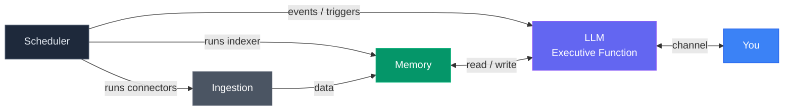

<p align="center">
  
</p>

# Edwin

**Personal AI Chief of Staff -- built on cognitive architecture principles.**

Edwin is an AI assistant that runs your life. Not a chatbot. Not a framework. A persistent, memory-rich system designed around how your brain actually works -- with working memory, episodic memory, semantic memory, and prospective memory. It ingests your digital life, learns what matters to you, and handles the cognitive overhead that buries busy professionals.

Built on [Claude Code](https://claude.ai/claude-code) by Anthropic. Runs locally on your Mac. Your data stays on your machine.

## Why Edwin is different

Most AI agent frameworks start with tools. Edwin starts with how your brain works.

- **Memory modeled on human cognition.** Five systems, same as your brain: working memory (active context), episodic memory (what happened), semantic memory (what you know), prospective memory (what you need to do), and procedural memory (how to do things).
- **The Briefing Book.** Your personal intelligence file, organized by cognitive domain -- briefs, calendar, actions, drafts, research, projects, people. Information goes where your brain expects to find it.
- **15 data connectors.** Email, calendar, iMessage, meeting transcripts, browser history, notes, photos, and more. Edwin sees what you see.
- **Procedural memory via SKILL.md.** Edwin's skills are plain markdown files -- portable, readable, editable. Each SKILL.md teaches Edwin how to perform a recurring task: morning briefs, overnight research, weekly summaries. This is procedural memory -- the same way your brain automates routines so you don't have to think about them. Any LLM that can read text can execute a skill. No proprietary format, no vendor lock-in.
- **Semantic search across your entire life.** Qdrant vector store with contextual retrieval. Ask Edwin anything and it finds the answer across all your data.

## Quickstart

```bash
git clone https://github.com/brandtwelker/Edwin.git
cd Edwin
./setup.sh
claude
```

That's it. `setup.sh` installs the infrastructure (Qdrant, Neo4j, Ollama). `claude` starts the onboarding wizard -- a guided conversation where Edwin learns who you are and configures itself for your life. Takes about 15 minutes.

### Requirements

- **macOS** (local connectors use macOS databases; API connectors work cross-platform)
- **Claude Code** with an active Anthropic subscription
- **Docker** (for Qdrant and Neo4j)
- **Ollama** (for local embeddings)
- **Python 3.10+**

## The Core Problem: An Assistant That Knows What You Know

A human chief of staff is useful because they're in the room. They hear the same conversations, read the same emails, sit in the same meetings. They don't need to be told what happened -- they already know. That's what makes their judgment valuable: shared context.

Most AI assistants fail here. They only know what you explicitly tell them. Every conversation starts from zero. You become the bottleneck -- manually feeding context into a system that should already have it.

Edwin solves this by ingesting every electronic communication channel you have. Email, calendar, iMessage, Teams, meeting transcripts, browser history, notes, ambient conversations. If you received it, saw it, or heard it -- Edwin has it too. All of it flows into structured memory (vector store for semantic search, knowledge graph for relationships, prospective memory for commitments) where it's searchable, associable, and retrievable on demand.

The result: when you ask Edwin to prep you for a meeting, draft a reply, or find that thing someone said last week -- it already has the context. You don't have to explain the backstory. Edwin was there.

If there's a channel of information I didn't think of -- a platform you use, a data source that matters to your workflow -- have your agent build a connector and contribute it back. I'd love to have it and use it myself.

## Ambient Intelligence

The most important data sources aren't the ones you type -- they're the ones that capture what happens around you. Edwin supports **ambient listening** through three connectors:

- **Limitless** -- wearable pendant that records and transcribes your conversations throughout the day. Every meeting, phone call, hallway conversation, and thinking-out-loud moment becomes searchable memory.
- **Fireflies** -- meeting transcript service that captures video calls. Every Zoom, Teams, and Google Meet is automatically transcribed and indexed.
- **Plaud** -- recording device that captures and transcribes in-person conversations, interviews, and notes.

These ambient sources are what make Edwin fundamentally different from an AI that only knows what you typed. Edwin knows what you SAID, what was said TO you, and what was said AROUND you. Your entire conversational life becomes part of your searchable memory. When you ask "what did we discuss about the project last Tuesday?" -- Edwin finds it because it was listening.

## The Briefing Book

In the real world, executive assistants and chiefs of staff prepare a **briefing book** before their principal walks into a meeting, boards a flight, or starts a day. It contains everything the executive needs to know, organized by domain: who they're meeting, what's pending, what happened overnight, what decisions are waiting.

Edwin does the same thing digitally. The Briefing Book is a structured folder system organized by cognitive domain:

| Section | What goes here | How it fills up |
|---------|---------------|----------------|
| Briefs | Morning/evening summaries | Generated daily by the morning-brief skill |
| Calendar | Today's schedule with context | Pulled from calendar connectors |
| Action Tracker | Open commitments and follow-ups | Captured from conversations via PM system |
| Drafts | Email replies, messages, documents in progress | Created when you ask Edwin to draft something |
| Overnight | Work Edwin did while you slept | Output from the overnight-loop skill |
| Research | Deep dives Edwin conducted | Generated by research tasks |
| Projects | Active project tracking | Organized as you discuss projects with Edwin |
| Products | Product specs and PRDs | Stored as reference material |
| People | Profiles, relationship context, meeting history | Built over time from interactions |
| Daytime Log | Running log of today's activity | Updated continuously |
| Operations | Edwin's own health and status | Generated by ops-dashboard skill |

The briefing book fills itself over time. You don't organize it -- Edwin does. When you ask "prep me for my 2 PM meeting," Edwin pulls from People (who's in the room), Projects (what you're working on with them), Action Tracker (what you owe them), and Calendar (the agenda) to build a brief. That's the workflow: Edwin assembles the intelligence, you walk in prepared.

## The Cognitive Model

Edwin's architecture maps directly to how human cognition works:

- **Ingestion = Sensory Input.** 15 ETL connectors perceive your digital world and translate raw data into a format the brain can process. Email, messages, meetings, browser history -- each connector is a sense tuned to a different source.
- **Memory = Memory & Cognition.** The data lake feeds five memory systems that store, index, associate, and recall. The LLM reads and writes to all of them.
- **LLM = Executive Function.** Perceive, decide, act, monitor, adjust. The prefrontal cortex. The main session talks to you and delegates all work to sub-agents.



## Design Principles

1. **No vendor lock-in.** The LLM is swappable. The data is portable. Skills are plain markdown. Nothing depends on any single AI provider except the LLM API itself.
2. **Atomic purposes.** Each component does one thing. Connectors extract. The indexer embeds. The PM tracks commitments. Nothing is overloaded.
3. **Local-first.** All data lives on disk, in open formats (Markdown, SQLite, standard APIs). Nothing is cloud-only.
4. **The LLM is the orchestrator.** The main session talks to you and makes decisions. All work is delegated to sub-agents. Edwin decides what work to do -- sub-agents do it.
5. **The SKILL.md standard.** Procedural memory is portable markdown. Any LLM that can read text can execute a skill. No proprietary format.
6. **Know what you have.** Every tool, every skill, every service is indexed and discoverable. Edwin never says "I can't do that" about something it can do.

## Architecture

```
Edwin/
├── CLAUDE.md              # Edwin's identity + operating instructions (generated by wizard)
├── connectors/            # 15 data connectors (email, calendar, iMessage, etc.)
├── tools/
│   ├── indexer/           # Embeds your data into Qdrant for semantic search
│   ├── plombery/          # Scheduler dashboard (APScheduler + web UI)
│   └── session-slicer/    # Claude Code session processing
├── skills/                # Autonomous recurring tasks (morning brief, overnight loop, etc.)
├── mcp-servers/           # Claude Code MCP integrations (Qdrant, Neo4j, PM)
├── briefing-book/         # Your personal intelligence file (auto-organized)
├── data/                  # Synced data from connectors (gitignored)
├── memory/                # Session summaries + memory index (gitignored)
├── setup.sh               # One-command installer
├── reset.sh               # Selective teardown for re-testing
└── docker-compose.yml     # Qdrant + Neo4j infrastructure
```

## How it works

1. **Connectors** pull your digital life into `data/` as structured Markdown
2. **Indexer** embeds that Markdown into Qdrant with semantic vectors
3. **MCP servers** give Claude Code access to search, query, and track commitments
4. **Skills** run on schedule via Plombery -- morning briefs, overnight work, weekly reviews
5. **CLAUDE.md** gives Edwin its identity, personality, and operating rules
6. **You talk to Edwin** in Claude Code. It remembers, anticipates, and handles the rest.

## Connectors

### macOS Native (local databases, no API keys)
| Connector | What it syncs |
|-----------|--------------|
| notes | Apple Notes |
| browser | Safari + Chrome history |
| imessage | iMessage conversations |
| photos | Apple Photos metadata |
| calls | Phone call logs |
| contacts | Apple Contacts |
| screentime | App usage data |
| documents | Desktop, Documents, iCloud files |
| sessions | Claude Code conversation logs |

### API-Based (cross-platform, requires credentials)
| Connector | What it syncs |
|-----------|--------------|
| o365 | Outlook email, calendar, Teams |
| google | Gmail, Google Calendar |
| fireflies | Meeting transcripts |
| limitless | Limitless pendant lifelogs |
| atlassian | Jira, Confluence, Bitbucket |
| plaud | Plaud recording transcripts |

## Memory Tiers

Five memory systems, modeled on human cognition:

| Type | Purpose | System | How it works |
|------|---------|--------|-------------|
| **Semantic** | What things mean | Qdrant vectors + Ollama embeddings | Dense (+ optional sparse) vector search across all your data |
| **Episodic** | What happened | Neo4j knowledge graph | Entity relationships, multi-hop reasoning, timeline queries |
| **Procedural** | How to do things | SKILL.md files | Portable markdown instructions any LLM can execute |
| **Prospective** | What needs to happen | PM server (SQLite) | Commitments, tasks, intentions with due dates and owners |
| **Working** | What matters right now | Context window + session state | Boot sequence, session summaries, conversation-state.md, morning brief |

Working memory is more than the LLM's context window. It's a full system: session state that survives crashes, session summaries for continuity across conversations, a boot sequence that reconstructs context on startup, and a morning brief that primes the most important information first.

## Embedding Options

Edwin supports three tiers of search quality, each opt-in:

| Tier | What | Cost | Requirement |
|------|------|------|-------------|
| Dense only | Ollama embeddings | Free | Ollama (included in setup) |
| Dense + Sparse | Adds BM42 hybrid search | Free | Python 3.12 + fastembed |
| Dense + Sparse + Context | Adds Haiku context prefixes | Varies with data volume | Anthropic API key |

Default is dense-only. Upgrade anytime by asking Edwin.

## Platform

macOS-native connectors ship today. Windows/Linux equivalents welcome as PRs -- the connector interface is simple and documented. API-based connectors work on any platform.

## License

Apache 2.0 -- see [LICENSE](LICENSE).

## Origin

I'm a CTO at a startup. I needed an executive assistant but didn't have time to hire and train one. So I built one -- and used the process to keep myself deep in AI while running an engineering team.

I use Edwin every day. It prepares my morning briefs, drafts my emails, tracks my commitments, runs research overnight while I sleep, and builds my weekly deliverables -- slide decks, status reports, analysis docs -- autonomously, without being asked. It manages information across multiple residences, multiple communication platforms, and more context than I could ever hold in my head. The result is a lower cognitive load, more time to be present with people, and the ability to focus on the work that actually requires my brain.

The architecture comes from cognitive science. The code comes from solving real problems every day and never being satisfied with "close enough."

---

*Built with [Claude Code](https://claude.ai/claude-code) by Anthropic.*
