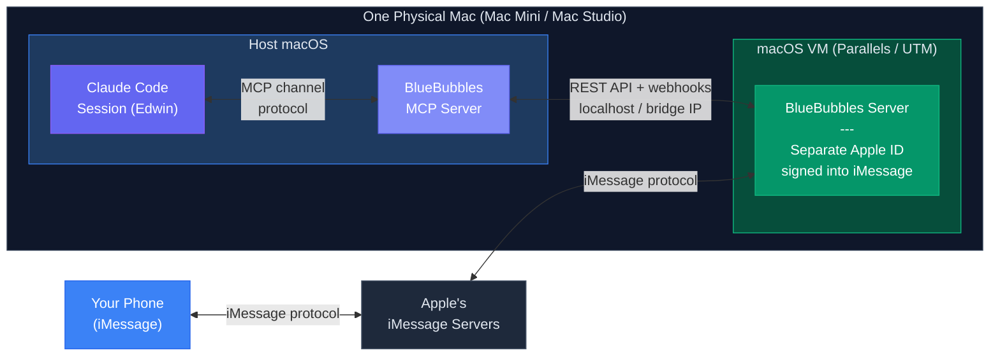

# iMessage Channel Setup (Advanced)

## Overview

The iMessage channel lets you talk to Edwin via iMessage instead of (or in addition to) Telegram. Messages from your phone arrive as channel events in your Claude Code session, exactly like Telegram messages do. Edwin can reply back through iMessage, creating a natural two-way conversation from your phone's Messages app.

This is an advanced setup. It requires a Mac running 24/7 with a macOS VM and a separate Apple ID. If you just want mobile access to Edwin, Telegram is simpler -- see the main README.

## Architecture

The recommended setup runs everything on **one physical Mac**. Edwin runs natively on the host macOS, while BlueBubbles runs inside a macOS VM on the same machine. The VM has its own Apple ID signed into iMessage, giving Edwin a separate iMessage identity.



**Message flow:**

Your phone (iMessage) --> Apple iMessage servers --> macOS VM (BlueBubbles server, separate Apple ID) --> localhost network --> BlueBubbles MCP server (host) --> Claude Code session (Edwin, host)

Since the VM and host are on the same physical machine, the network connection between BlueBubbles and the MCP server is just localhost or the VM's bridge IP -- no complex networking, no port forwarding, no VPN.

## Why This Setup

Apple does not expose iMessage APIs. There is no official way to programmatically send or receive iMessages. [BlueBubbles](https://bluebubbles.app) is an open-source server that bridges iMessage to a REST API by running on a Mac with an active iMessage account and intercepting messages through the macOS Messages framework.

The VM approach keeps everything on one box:

- **No second Mac to buy or maintain.** A single Mac Mini or Mac Studio handles both Edwin and BlueBubbles.
- **Localhost networking.** The VM and host communicate over the local bridge network -- no firewall rules, no LAN IP dependencies.
- **Simpler failure modes.** One machine to keep powered on, one machine to monitor.
- **Clean separation.** The VM isolates BlueBubbles and its Apple ID from your host macOS environment.

### Alternative: Separate Physical Mac

If you prefer not to run a VM, you can use a second Mac (Mac Mini, old MacBook, spare iMac) as a dedicated BlueBubbles server. The setup is nearly identical -- just replace "VM" with "second Mac" and use LAN IPs instead of localhost. This was the original approach documented here, and it still works fine. The tradeoff is extra hardware cost and a second machine to keep powered on.

## Requirements

| Requirement | Details |
|-------------|---------|
| Mac (host) | Mac Mini ($599+) or Mac Studio recommended. Any Apple Silicon Mac works. This runs Edwin and hosts the VM. |
| VM software | **Parallels Desktop** ($99/yr) or **UTM** (free, open-source). Both support macOS guests on Apple Silicon. |
| macOS installer | For creating the VM. Download from the App Store or Apple's developer site. |
| Separate Apple ID | Free to create at [appleid.apple.com](https://appleid.apple.com). This is the Apple ID that will "be" Edwin on iMessage. |
| Phone number for the Apple ID | Needed for iMessage activation. Can use a secondary SIM, Google Voice number, or any number that can receive SMS for verification. |
| BlueBubbles server | Free, open-source. Download from [bluebubbles.app](https://bluebubbles.app). Runs inside the VM. |
| Bun runtime | For running the MCP server on the host. Install from [bun.sh](https://bun.sh). |

## Step-by-Step Setup

### 1. Create the macOS VM

**Using Parallels:**
1. Open Parallels Desktop
2. Choose "Install Windows, Linux, or macOS from an image file" (or use the assistant)
3. Select "Download macOS" or point to a macOS installer
4. Allocate at least 4 CPU cores and 8 GB RAM (BlueBubbles is lightweight, but macOS itself needs room)
5. Complete the macOS installation

**Using UTM:**
1. Open UTM and click "Create a New Virtual Machine"
2. Choose "Virtualize" --> "macOS"
3. Select the macOS IPSW restore image (UTM can download it for you)
4. Allocate at least 4 CPU cores and 8 GB RAM
5. Complete the macOS installation

**After VM creation (either method):**
1. Sign in with the **dedicated Apple ID** (not your personal one)
2. Open the **Messages** app and sign in with the same Apple ID
3. Verify iMessage is working -- send a test message from your phone to the Apple ID's email or phone number
4. Disable sleep in the VM: **System Settings > Energy Saver** -- set "Prevent automatic sleeping" to **On**
5. Configure the VM to start automatically when the host boots (Parallels: VM config > Startup and Shutdown; UTM: use a launch agent)

> **Note:** Apple's EULA permits macOS virtual machines on Apple hardware. Running a macOS VM on non-Apple hardware (e.g., a cloud VM on AWS/GCP) violates the license agreement.

### 2. Install BlueBubbles Server (in the VM)

1. Download the BlueBubbles server from [bluebubbles.app](https://bluebubbles.app) inside the VM
2. Install and run the app
3. Walk through the setup wizard:
   - It will ask for Full Disk Access (required to read the iMessage database)
   - It will generate a **server password**
   - It will configure the **Private API** (needed for sending messages, reactions, read receipts)
4. Note the **server URL** shown in the BlueBubbles dashboard. Since the VM is on the same machine, this will be the VM's bridge IP (e.g., `http://10.211.55.3:1234` for Parallels or `http://192.168.64.2:1234` for UTM)
5. Note the **password** -- you will need both for the MCP server configuration
6. Verify the server is reachable from the host by visiting the URL in a browser on your host Mac

### 3. Configure the MCP Server

Set the following environment variables (e.g., in a `.env` file in the `mcp-servers/bluebubbles-channel/` directory, or in your shell profile):

```bash
# Required
BB_URL=http://10.211.55.3:1234             # VM's bridge IP + BlueBubbles port
BB_PASSWORD=your-server-password            # Password from BlueBubbles setup
ALLOWED_SENDERS=+15551234567                # Comma-separated E.164 phone numbers
OWNER_PHONE=+15551234567                    # Your phone number (for permission relay)
OWNER_NAME=YourName                         # Your display name in channel events

# Optional
WEBHOOK_PORT=18800                          # Port for webhook listener (default: 18800)
WEBHOOK_HOST=10.211.55.1                    # Host IP as seen from the VM (gateway IP)
SENDER_MAP='{ "+15551234567": "Alice", "+15559876543": "Bob" }'  # Display names
```

**A note on networking:** Since both the host and VM are on the same machine, the network is the VM's virtual bridge. The `BB_URL` uses the VM's IP, and `WEBHOOK_HOST` should be the host's IP as seen from inside the VM (typically the gateway address). You can find these by running `ifconfig` in both the host and the VM.

**Environment variable reference:**

| Variable | Required | Description |
|----------|----------|-------------|
| `BB_URL` | Yes | BlueBubbles server URL (the VM's bridge IP + port, e.g., `http://10.211.55.3:1234`) |
| `BB_PASSWORD` | Yes | Password from the BlueBubbles server setup |
| `ALLOWED_SENDERS` | Yes | Comma-separated list of phone numbers (E.164 format) allowed to send messages. Messages from unlisted numbers are silently ignored. |
| `OWNER_PHONE` | Yes | Your phone number in E.164 format. Used for permission relay messages. |
| `OWNER_NAME` | Yes | Your display name in channel events. |
| `WEBHOOK_PORT` | No | Port for the local webhook HTTP server (default: `18800`) |
| `WEBHOOK_HOST` | No | The host's IP as seen from the VM (gateway/bridge IP). Used for webhook registration. |
| `SENDER_MAP` | No | JSON object mapping phone numbers to display names for channel events. |

Install dependencies:

```bash
cd mcp-servers/bluebubbles-channel
bun install
```

### 4. Add to Edwin's MCP Config

Add the BlueBubbles channel server to your `.mcp.json`:

```json
{
  "mcpServers": {
    "bluebubbles": {
      "command": "bun",
      "args": ["run", "mcp-servers/bluebubbles-channel/index.ts"],
      "env": {
        "BB_URL": "http://10.211.55.3:1234",
        "BB_PASSWORD": "your-server-password",
        "ALLOWED_SENDERS": "+15551234567",
        "OWNER_PHONE": "+15551234567",
        "OWNER_NAME": "YourName",
        "WEBHOOK_HOST": "10.211.55.1"
      }
    }
  }
}
```

Launch Edwin with the channel flags:

```bash
claude --dangerously-load-development-channels server:bluebubbles server:events
```

If you also use Telegram:

```bash
claude --dangerously-load-development-channels plugin:telegram@claude-plugins-official server:bluebubbles server:events
```

### 5. Pair Your Phone

1. Open Messages on your phone
2. Start a new conversation with the Apple ID on the VM (its email address or phone number)
3. Send a message -- "Hello Edwin" or anything
4. The message should appear as a channel event in your Claude Code session
5. Edwin will reply through the `bluebubbles_reply` tool, and the reply appears in your Messages app

From this point on, you can text Edwin like any contact in your phone.

## How It Works in Practice

1. You send a text from your phone to Edwin's Apple ID -- just like texting anyone
2. Apple's iMessage servers deliver the message to the macOS VM (where that Apple ID is signed in)
3. BlueBubbles server (running in the VM) detects the new message and fires a webhook to the host
4. The MCP server (running on the host) receives the webhook, checks the sender against `ALLOWED_SENDERS`, and pushes it into your Claude Code session as a channel event
5. Edwin processes the message and responds using the `bluebubbles_reply` tool
6. The MCP server sends the reply to BlueBubbles via the VM's bridge IP
7. BlueBubbles sends the reply through the VM's iMessage account
8. The reply appears on your phone as a normal iMessage

The experience is indistinguishable from texting a real person. You get read receipts, tapbacks, and full iMessage features.

## Limitations

- **Requires always-on Mac hardware.** The host Mac must stay powered on with the VM running and BlueBubbles active. If the Mac sleeps or the VM shuts down, the channel goes offline.
- **VM resource overhead.** The macOS VM consumes ~4 GB RAM and some CPU even when idle. On a Mac Mini with 16 GB+ this is negligible, but worth noting on constrained machines.
- **iMessage only.** This channel handles iMessage conversations. SMS fallback depends on BlueBubbles configuration and the carrier setup in the VM.
- **Separate identity.** The VM uses its own Apple ID. Contacts will see a different phone number or email address than your personal one. You are effectively texting a separate "person" (Edwin).
- **Apple hardware required.** macOS VMs are only legally permitted on Apple hardware. Cloud VMs on AWS/GCP/Azure are not an option due to Apple's EULA.
- **More complex than Telegram.** Telegram requires zero hardware and works with a simple bot token. iMessage requires a Mac, a VM, a separate Apple ID, and ongoing maintenance of BlueBubbles. Choose iMessage if you specifically want the native Messages app experience.

## Troubleshooting

**Messages are not arriving in Claude Code:**
- Verify BlueBubbles server is running in the VM (check its dashboard)
- Confirm the `BB_URL` is reachable from the host: `curl http://<BB_URL>/api/v1/server/info?password=<BB_PASSWORD>`
- Check that `ALLOWED_SENDERS` includes the sender's phone number in E.164 format (e.g., `+15551234567`)
- Verify you launched Claude Code with the `--dangerously-load-development-channels server:bluebubbles` flag
- Check the BlueBubbles MCP server logs in stderr for error messages

**Replies are not being sent:**
- Verify `BB_PASSWORD` is correct
- Check that BlueBubbles has the Private API enabled (required for sending messages)
- Confirm the `chat_guid` format is correct -- it should look like `iMessage;-;+15551234567`
- Check the BlueBubbles server logs in the VM for send errors

**Webhooks are not registering:**
- Ensure `WEBHOOK_HOST` is set to the host's IP as seen from the VM (the bridge gateway IP, not `localhost`)
- Check that `WEBHOOK_PORT` (default 18800) is not blocked by the host's firewall
- Verify webhook registration in the BlueBubbles dashboard under Settings > Webhooks
- Test connectivity from inside the VM: `curl http://<WEBHOOK_HOST>:<WEBHOOK_PORT>`

**BlueBubbles server keeps disconnecting:**
- Make sure the VM does not suspend (check VM settings for auto-suspend/pause behavior)
- Ensure iMessage is still signed in inside the VM
- Check that the Apple ID has not been locked or requires re-authentication

**VM networking issues:**
- Run `ifconfig` in the VM to confirm its bridge IP
- Run `ifconfig` on the host to confirm the bridge interface exists
- Try pinging the host from the VM and vice versa
- If using UTM, ensure the network mode is set to "Shared" (NAT) -- this is the default and works for this use case
