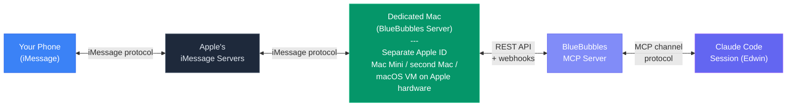

# iMessage Channel Setup (Advanced)

## Overview

The iMessage channel lets you talk to Edwin via iMessage instead of (or in addition to) Telegram. Messages from your phone arrive as channel events in your Claude Code session, exactly like Telegram messages do. Edwin can reply back through iMessage, creating a natural two-way conversation from your phone's Messages app.

This is an advanced setup. It requires dedicated Mac hardware running 24/7 with a separate Apple ID. If you just want mobile access to Edwin, Telegram is simpler -- see the main README.

## Architecture



## Why This Setup

Apple does not expose iMessage APIs. There is no official way to programmatically send or receive iMessages. [BlueBubbles](https://bluebubbles.app) is an open-source server that bridges iMessage to a REST API by running on a Mac with an active iMessage account and intercepting messages through the macOS Messages framework.

This means you need:

- A **dedicated Mac** with its own Apple ID signed into iMessage
- That Mac must **stay on 24/7** for the channel to work
- The Mac needs **network connectivity** to the machine running Edwin

The dedicated Mac acts as a relay -- your phone sends an iMessage to its Apple ID, BlueBubbles catches the message, and the MCP server pushes it into your Claude Code session.

## Requirements

| Requirement | Details |
|-------------|---------|
| Dedicated Mac | Mac Mini recommended (~$599). Any Mac works -- a second MacBook, an old iMac, or a macOS VM on Apple hardware. |
| Separate Apple ID | Free to create at [appleid.apple.com](https://appleid.apple.com). This is the Apple ID that will "be" Edwin on iMessage. |
| Phone number for the Apple ID | Needed for iMessage activation. Can use a secondary SIM, Google Voice number, or any number that can receive SMS for verification. |
| BlueBubbles server | Free, open-source. Download from [bluebubbles.app](https://bluebubbles.app). |
| Network connectivity | The dedicated Mac and the machine running Edwin must be able to reach each other over the network (same LAN, VPN, or port forwarding). |
| Bun runtime | For running the MCP server. Install from [bun.sh](https://bun.sh). |

## Step-by-Step Setup

### 1. Prepare the Dedicated Mac

1. Set up macOS on the dedicated machine (fresh install or existing)
2. Sign in with the **dedicated Apple ID** (not your personal one)
3. Open the **Messages** app and sign in with the same Apple ID
4. Verify iMessage is working -- send a test message from your phone to the Apple ID's email or phone number
5. Disable sleep: **System Settings > Energy Saver** (or **Battery > Options** on laptops)
   - Set "Turn display off after" to a short time (display can sleep)
   - Set "Prevent automatic sleeping when the display is off" to **On**
6. Enable auto-login: **System Settings > Users & Groups > Login Options > Automatic login**

> **Note:** Apple's EULA only permits macOS virtual machines on Apple hardware. Running a macOS VM on non-Apple hardware (e.g., a cloud VM on AWS/GCP) violates the license agreement.

### 2. Install BlueBubbles Server

1. Download the BlueBubbles server from [bluebubbles.app](https://bluebubbles.app)
2. Install and run the app
3. Walk through the setup wizard:
   - It will ask for Full Disk Access (required to read the iMessage database)
   - It will generate a **server password**
   - It will configure the **Private API** (needed for sending messages, reactions, read receipts)
4. Note the **server URL** shown in the BlueBubbles dashboard (e.g., `http://192.168.1.100:1234`)
5. Note the **password** -- you will need both for the MCP server configuration
6. Verify the server is running by visiting the URL in a browser -- you should see the BlueBubbles API response

### 3. Configure the MCP Server

Set the following environment variables (e.g., in a `.env` file in the `mcp-servers/bluebubbles-channel/` directory, or in your shell profile):

```bash
# Required
BB_URL=http://192.168.1.100:1234       # Your BlueBubbles server URL
BB_PASSWORD=your-server-password        # Password from BlueBubbles setup
ALLOWED_SENDERS=+15551234567            # Comma-separated E.164 phone numbers
OWNER_PHONE=+15551234567                # Your phone number (for permission relay)
OWNER_NAME=YourName                     # Your display name in channel events

# Optional
WEBHOOK_PORT=18800                      # Port for webhook listener (default: 18800)
WEBHOOK_HOST=192.168.1.200              # LAN IP of the machine running Edwin
SENDER_MAP='{ "+15551234567": "Alice", "+15559876543": "Bob" }'  # Display names
```

**Environment variable reference:**

| Variable | Required | Description |
|----------|----------|-------------|
| `BB_URL` | Yes | BlueBubbles server URL (e.g., `http://192.168.1.100:1234`) |
| `BB_PASSWORD` | Yes | Password from the BlueBubbles server setup |
| `ALLOWED_SENDERS` | Yes | Comma-separated list of phone numbers (E.164 format) allowed to send messages. Messages from unlisted numbers are silently ignored. |
| `OWNER_PHONE` | Yes | Your phone number in E.164 format. Used for permission relay messages. |
| `OWNER_NAME` | Yes | Your display name in channel events. |
| `WEBHOOK_PORT` | No | Port for the local webhook HTTP server (default: `18800`) |
| `WEBHOOK_HOST` | No | The LAN IP of the machine running Edwin, visible to the BlueBubbles server. Used for webhook registration. |
| `SENDER_MAP` | No | JSON object mapping phone numbers to display names for channel events. |

Install dependencies:

```bash
cd mcp-servers/bluebubbles-channel
bun install
```

### 4. Add to Edwin's MCP Config

Add the BlueBubbles channel server to your `.mcp.json`:

```json
{
  "mcpServers": {
    "bluebubbles": {
      "command": "bun",
      "args": ["run", "mcp-servers/bluebubbles-channel/index.ts"],
      "env": {
        "BB_URL": "http://192.168.1.100:1234",
        "BB_PASSWORD": "your-server-password",
        "ALLOWED_SENDERS": "+15551234567",
        "OWNER_PHONE": "+15551234567",
        "OWNER_NAME": "YourName",
        "WEBHOOK_HOST": "192.168.1.200"
      }
    }
  }
}
```

Launch Edwin with the channel flags:

```bash
claude --dangerously-load-development-channels server:bluebubbles server:events
```

If you also use Telegram:

```bash
claude --dangerously-load-development-channels plugin:telegram@claude-plugins-official server:bluebubbles server:events
```

### 5. Pair Your Phone

1. Open Messages on your phone
2. Start a new conversation with the Apple ID on the dedicated Mac (its email address or phone number)
3. Send a message -- "Hello Edwin" or anything
4. The message should appear as a channel event in your Claude Code session
5. Edwin will reply through the `bluebubbles_reply` tool, and the reply appears in your Messages app

From this point on, you can text Edwin like any contact in your phone.

## How It Works in Practice

1. You send a text from your phone to Edwin's Apple ID -- just like texting anyone
2. The dedicated Mac receives the iMessage through Apple's servers
3. BlueBubbles server detects the new message and fires a webhook
4. The MCP server receives the webhook, checks the sender against `ALLOWED_SENDERS`, and pushes it into your Claude Code session as a channel event
5. Edwin processes the message and responds using the `bluebubbles_reply` tool
6. BlueBubbles sends the reply through the dedicated Mac's iMessage account
7. The reply appears on your phone as a normal iMessage

The experience is indistinguishable from texting a real person. You get read receipts, tapbacks, and full iMessage features.

## Limitations

- **Requires always-on Mac hardware.** The dedicated Mac must stay powered on with BlueBubbles running. If it sleeps or shuts down, the channel goes offline. Cloud VMs on non-Apple hardware are not an option due to Apple's EULA.
- **iMessage only.** This channel handles iMessage conversations. SMS fallback depends on BlueBubbles configuration and the carrier setup on the dedicated Mac.
- **Separate identity.** The dedicated Mac uses its own Apple ID. Contacts will see a different phone number or email address than your personal one. You are effectively texting a separate "person" (Edwin).
- **Network dependency.** The machine running Edwin and the dedicated Mac must be able to reach each other over the network. If they are on different networks, you will need port forwarding, a VPN, or a tunneling service.
- **More complex than Telegram.** Telegram requires zero hardware and works with a simple bot token. iMessage requires a dedicated Mac, a separate Apple ID, and ongoing maintenance of the BlueBubbles server. Choose iMessage if you specifically want the native Messages app experience.

## Troubleshooting

**Messages are not arriving in Claude Code:**
- Verify BlueBubbles server is running on the dedicated Mac (check its dashboard)
- Confirm the `BB_URL` is reachable from the machine running Edwin: `curl http://<BB_URL>/api/v1/server/info?password=<BB_PASSWORD>`
- Check that `ALLOWED_SENDERS` includes the sender's phone number in E.164 format (e.g., `+15551234567`)
- Verify you launched Claude Code with the `--dangerously-load-development-channels server:bluebubbles` flag
- Check the BlueBubbles MCP server logs in stderr for error messages

**Replies are not being sent:**
- Verify `BB_PASSWORD` is correct
- Check that BlueBubbles has the Private API enabled (required for sending messages)
- Confirm the `chat_guid` format is correct -- it should look like `iMessage;-;+15551234567`
- Check the BlueBubbles server logs for send errors

**Webhooks are not registering:**
- Ensure `WEBHOOK_HOST` is set to an IP that the BlueBubbles server can reach (not `localhost` or `127.0.0.1` unless they are on the same machine)
- Check that `WEBHOOK_PORT` (default 18800) is not blocked by a firewall
- Verify webhook registration in the BlueBubbles dashboard under Settings > Webhooks

**BlueBubbles server keeps disconnecting:**
- Make sure the dedicated Mac does not go to sleep (check Energy Saver settings)
- Ensure iMessage is still signed in on the dedicated Mac
- Check that the Apple ID has not been locked or requires re-authentication
